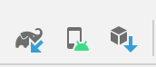
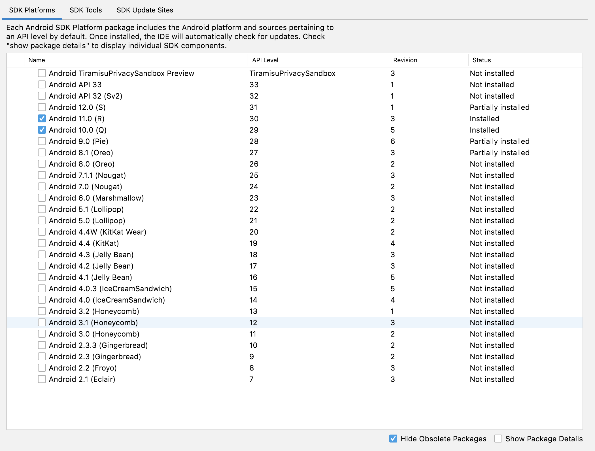
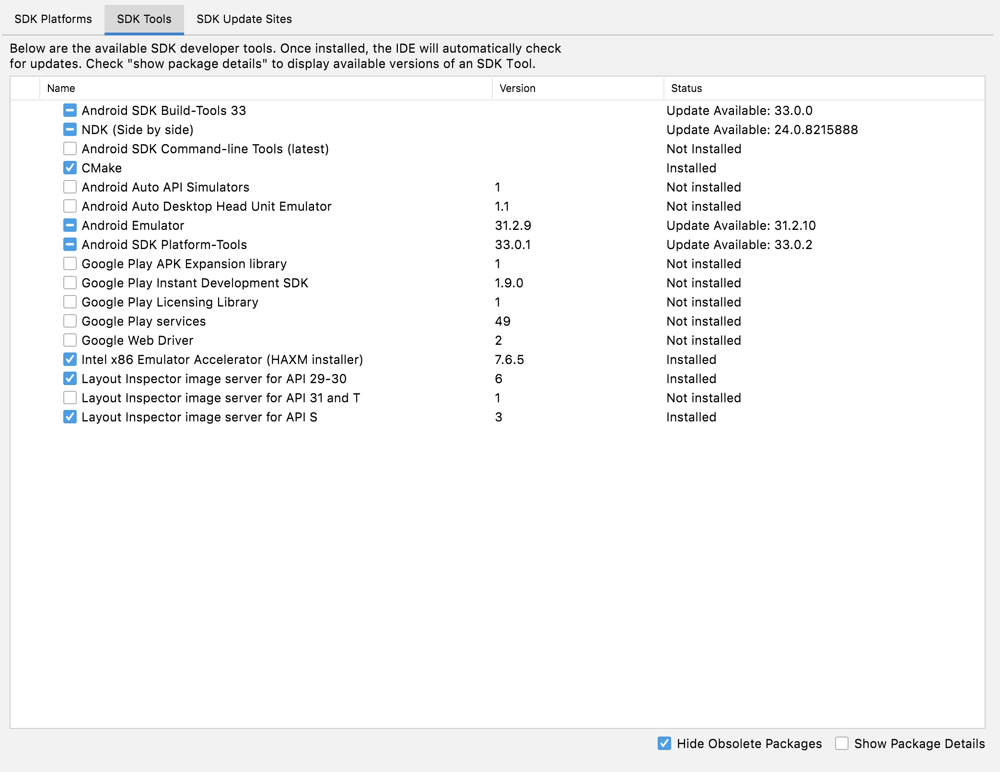
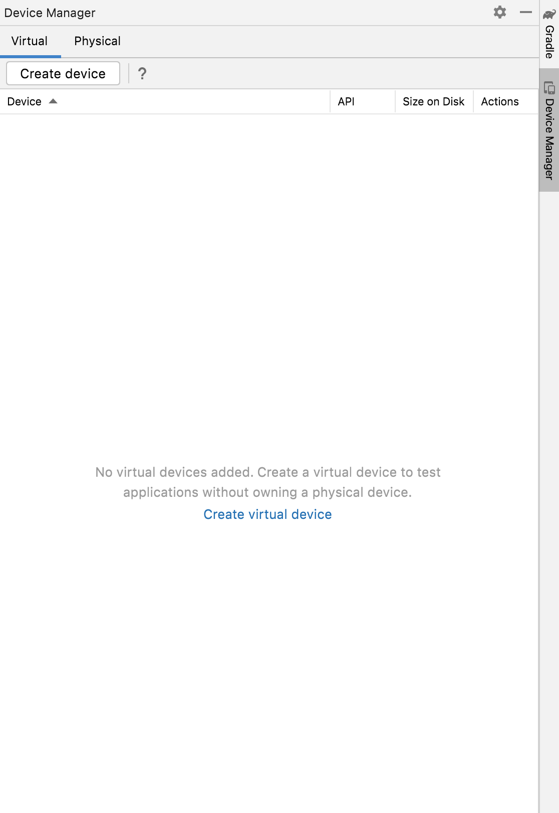
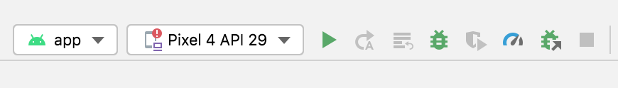

# LCL Network Performance Measurement Tool

**LCL Network Measurement Tool** is an Android App that measures a variety of network metrics, including but not limited to *ping*, *upload/download* speed, *signal strength*.
It also automatically uploads the testing results to the backend server, which will then be displayed on [our coverage map](https://coverage.seattlecommunitynetwork.org/).

## Project Structure
```
app/src/main/java
└── com
    └── lcl
        └── lclmeasurementtool
            ├── Utils
            ├── Receivers
            ├── Models
            ├── Managers
            ├── Functionality
            ├── Database
            │   ├── Entity
            │   └── DB
            └── Constants
```

In each sub-directory, there is a README file explaining the module. 


## Building, Running, and Installing the project
### Prerequisite
* We use Android Studio for development. Download the latest version of Android Studio [here](https://developer.android.com/studio).
  * Android SDK 30 (make sure you have SDK version 30 or above)
  * Android NDK    (Download the latest NDK either from Android's website or in Android Studio)
  * Android Emulator
* Git

### Managing SDK, NDK, and Emulators
Android Studio has tools to help manage the SDK, NDK, and Emulators resources.



#### SDK and NDK
Android SDK is a component for building apps on Android platform.
Android NDK is a toolset that lets you implement parts of your app in native code, using languages such as C and C++.

To properly configure SDK and NDK for the project. First go to the `SDK Platform` pane, and check the SDK with API level equal to or greater than 30.


Then click `SDK Tools`, make sure at least NDK and CMake are checked. 


Finally, click `OK` and wait for these tools to be installed.

#### Emulators
If you do not have a Andriod Phone, you can install emulators to run the app. Click the `Device Manager` button in the middle. Then click `Create device`.
Select a phone target (we recommend using Pixel 4). Then select your system image, which should match your API level. Finally click `Finish` and wait for the emulator to be created.


For more information, visit [Android Developer Website](https://developer.android.com/studio/releases/platforms)

### Building, Running and Debugging the Code
Android Studio provides out-of-box build tool and debugger to help build, run, and debug.

#### Open the project
* In order to build the code, clone this project repo to your working folder 
  * using HTTPS: `$ git clone https://github.com/Local-Connectivity-Lab/lcl_measurement_tool.git`
  * using SSH if you have set it up: `$ git@github.com:Local-Connectivity-Lab/lcl_measurement_tool.git`
* `cd` into the directory `lcl_measurement_tool` and change the branch from `main` to `dev` to view the latest codebase `$ git checkout dev`
* Open the project using Android Studio. Wait for Android Studio to automatically install Gradle and other dependencies used by the project.

#### Building the project
* On the top menu bar, find the `Build -> Clean Project` to remove any previous build. Then `Build -> Rebuild Project`.
* [Optional] On the bottom menu bar, find the Build Panel and view the Build process.

#### Running/Debugging the project
After building the project, we can use Android Studio's "Play" button in the toolbar to run the project on an actual Android phone or in the Emulator of your choice.
If you need to debug the code, add breakpoints and then click the `bug` button in the toolbar. Android Studio will pop up a debugger attached to the process. 
 Make sure the target shows as `app`. 

#### Profiling and Inspection
If you need to inspect the network packet or checking the app's running state, you can use Android Studio's built-in profiler located at the bottom toolbar.
Make sure you open the profiler when the app is running. To inspect the database, using the App Inspection tool located at the bottom toolbar.


## Contributing to the Project
We are excited to work alongside you, our amazing community, to build and enhance this measurement tool! If you want to contribute to this project, contact Esther Jang(infared) or Zhennan Zhou(Johnnnzhou) in our Discord channel. 

### Getting involved with Seattle Community Networks Team
If you are interested in contributing to the community, visit our [website](https://seattlecommunitynetwork.org/), join our [Discord channel](https://discord.gg/sZkK5RpeCE),
and follow us on social media: [Instagram](https://instagram.com/seattlecommnet), [Facebook](https://facebook.com/seattlecommnet), and [Twitter](https://twitter.com/seattlecommnet).

For more information, visit our [Get Started Pro Tips](https://docs.seattlecommunitynetwork.org/get-started.html).


